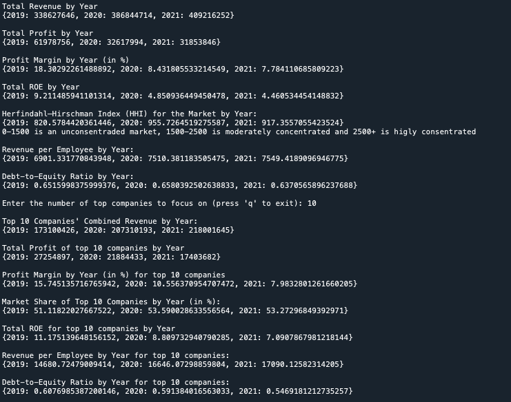
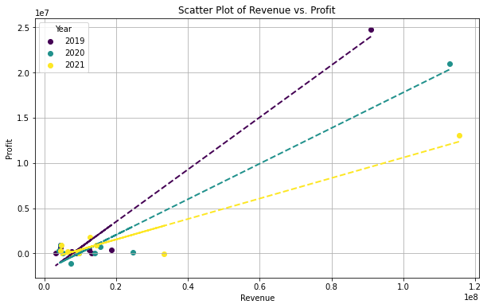

# Market-Analysis
Market Tool is a Python script designed to analyze and visualize key financial metrics for businesses, providing valuable insights into the state of a particular market. This tool can assist users in making informed decisions based on various indicators such as Return on Equity (ROE), Revenue, Profit, and more.

## Concept
When confronted with an extensive volume of market data, navigating through the information can become a daunting task. Thousands of cells filled with data extracted from balance sheets and income statements of hundreds or even thousands of companies create a complex landscape of numbers. In this intricate web of financial figures, a guiding tool becomes essential. Enter Market_tool, a specialized piece of code designed to streamline the market analysis process.

Market_tool acts as a guiding light, swiftly providing a comprehensive overview through key values and visualization tools. This tool simplifies the market analysis by offering a quick glance at essential metrics, enabling users to efficiently interpret and comprehend the market dynamics.
## Features
**The intire market**
* Total Revenue by Year for the whole market
  * Line graph showing this
* Total profit by Year for the whole market
  * Line graph showing this 
* Total profit margin by Year for the whole market
  * Line graph showing this
* Total ROE (Return On Equity) ratio by Year for the whole market
* Total Revenue per Employee by Year for the whole market
* HHI (Herfindahl–Hirschman Index) by Year for the whole market

**The largest companies in the market, you shoose the number of companies to focus on**
* Total Revenue by Year for the largest companies
  * Line graph showing this
* Total profit by Year for the largest companies
  * Line graph showing this
* Total profit margin by Year for the largest companies
  * Line graph showing this
* Total ROE (Return On Equity) ratio by Year for the largest companies
* Total Revenue per Employee by Year for the largest companies
* Scatter plot of the largest companies' profit vs revenue with a regression line. This for every year
* Scatter plot of the largest companies' Revenue per Employee vs revenue. This for every year

**Example of the data that is obtained**


**Example of one of the scatterplots obtained (largest companies' profit vs revenue with regression line, for every year)**


## Getting Started

### Formating the data
The data needs to be a csv file named Data.csv where the data starts from row 1. **NO HEADLINE!**

**Each attribute should be in the column as Follows:**

| Column | Description                |
|--------|----------------------------|
| 1      | Company_ID                 |
| 2      | company_type               |
| 3      | founded                    |
| 4      | region                     |
| 5      | county                     |
| 6      | Sum_operatingcosts         |
| 7      | Material_assets            |
| 8      | accounts_receivable        |
| 9      | Cash_and_bank              |
| 10     | Sum_assets                 |
| 11     | Long_term_liabilities      |
| 12     | Accounts_payable           |
| 13     | Current_liabilities        |
| 14     | Shareholders'_equity       |
| 15     | Corporation_tax            |
| 16     | Sum_financial_assets       |
| 17     | Finished_goods             |
| 18     | Employees                  |
| 19     | Revenue                    |
| 20     | Profit                     |
| 21     | Year                       |

This program utilizes data from columns 1, 11, 12, 13, 14, 18, 19, 20, and 21. Therefore, these attributes are essential for the program in its current state.

### Where to store the data to make the program work as is

Within the same directory as the 'Market_tool.py' code, create a folder named 'data'. Place your 'Data.csv' file inside this 'data' folder.

Feel free to download the entire 'Market_tool' folder and substitute the 'Data.csv' file with your own dataset. Alternatively, you can explore the program using the sample data provided.

### How to use the program
When you run the program, it will generate key values and graphs for the entire market.

Afterward, you will be prompted to choose how many of the largest companies you want to focus on. Once you've selected the number, the program will provide key values and graphs specifically for those top companies. You can repeat this process as many times as you'd like, entering 'q' to end the program when you are satisfied.


## License
```
Copyright (c) 2023 by Anton Hänström
Permission is granted, free of charge, to any person obtaining a copy of this software
and associated documentation files (the "Software"), to use, copy, modify, merge,
publish, distribute, sublicense, and/or sell copies of the Software. The conditions are as follows:

The above copyright notice and this permission notice must be included in
all copies or substantial portions of the Software.

THE SOFTWARE IS PROVIDED "AS IS," WITHOUT WARRANTY OF ANY KIND, EXPRESS OR IMPLIED, INCLUDING
BUT NOT LIMITED TO THE WARRANTIES OF MERCHANTABILITY, FITNESS FOR A PARTICULAR PURPOSE, AND
NONINFRINGEMENT. IN NO EVENT SHALL THE AUTHORS OR COPYRIGHT HOLDERS BE LIABLE FOR ANY CLAIM,
DAMAGES, OR OTHER LIABILITY, WHETHER IN AN ACTION OF CONTRACT, TORT, OR OTHERWISE, ARISING
FROM, OUT OF, OR IN CONNECTION WITH THE SOFTWARE OR THE USE OR OTHER DEALINGS IN THE SOFTWARE.
```

**Note:** This tool is designed for educational and analytical purposes. Always consider professional financial advice before making business decisions.
